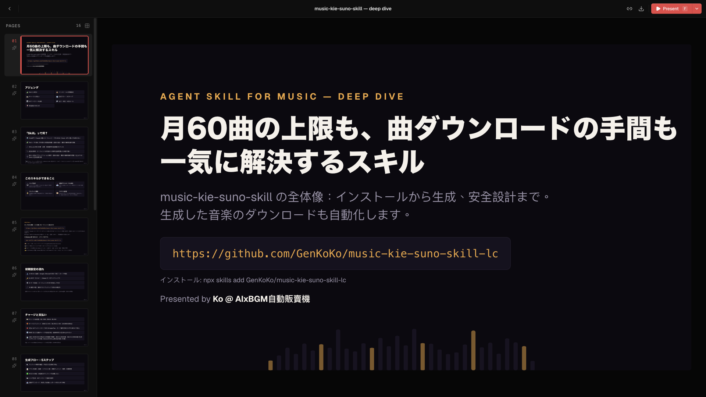
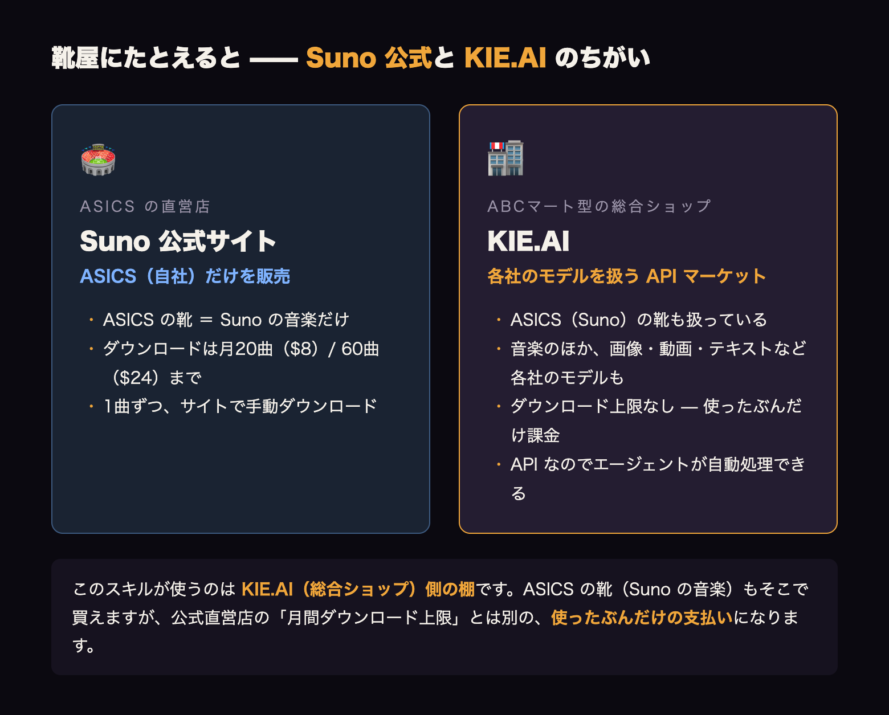
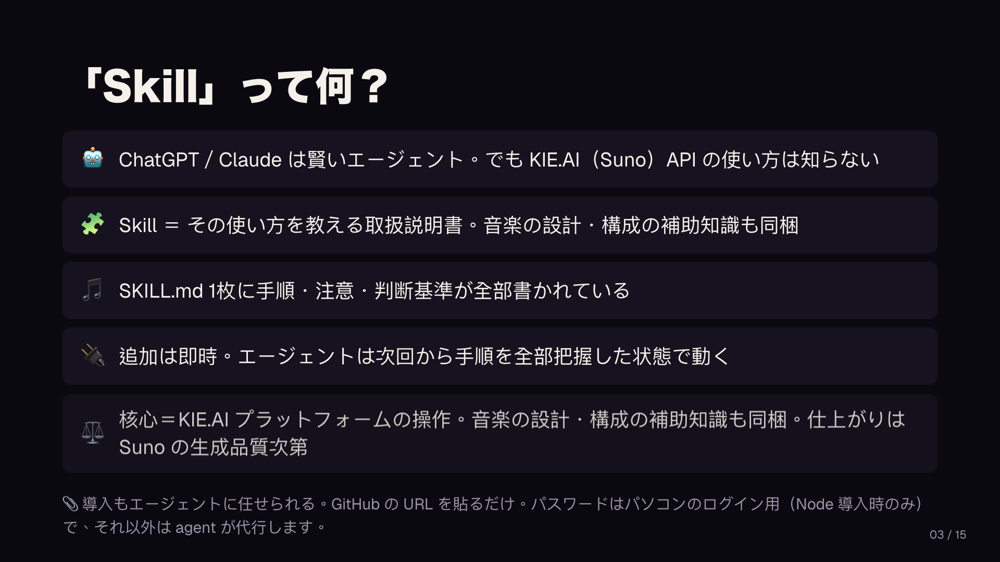
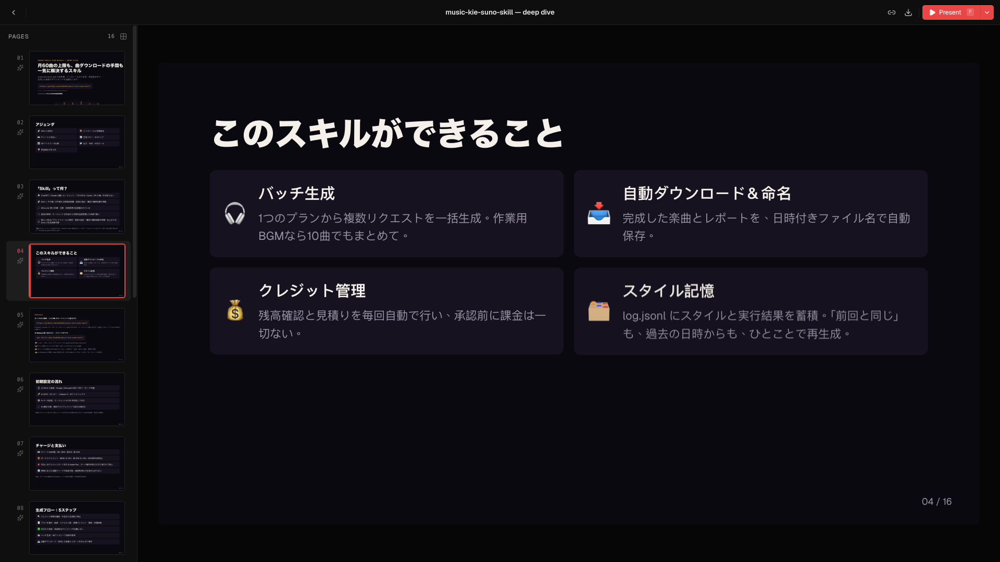
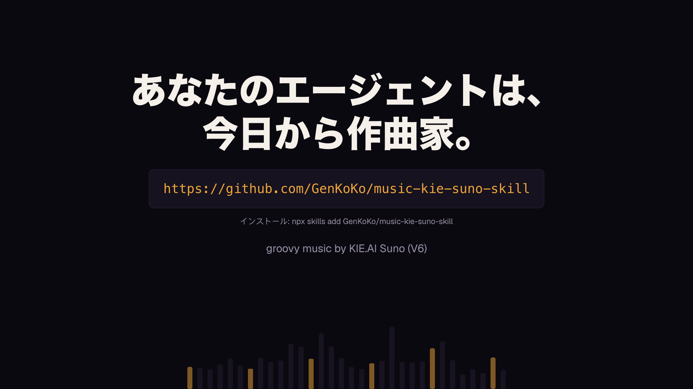

ーーー

ーーー

Sunoの『月60曲ダウンロード制限』対策——ChatGPT／Claudeのスキルで「生成とダウンロード上限なし・自動ダウンロード・必要なぶんだけ課金」に切り替える方法

## はじめに：3行でまとめ

**この記事は、ChatGPT／Claude デスクトップアプリ（コードモード）を使っていて、BGM などを継続的に作りたい方向けの紹介記事です。**

生成そのものだけでなく、できた曲の手動ダウンロードや管理が面倒という悩みにも答えます。月に数曲で足りている方には、必要ありません。

- ChatGPT／Claude にスキルを1つ追加すると、KIE.AI 経由で Suno の曲を「依頼 → 生成 → 保存」まで自動化できます
- Suno 公式サブスクの月間ダウンロード上限（Pro 20曲／Premier 60曲）に縛られない、従量課金のルートです
- 導入は GitHub の URL をエージェントに貼るだけ。用意するのは KIE.AI の無料アカウントとAPIキーだけ

🎬 全16ページの解説スライド：[**https://genkoko.github.io/music-kie-suno-skill/s/music-skill-deep-dive**](https://genkoko.github.io/music-kie-suno-skill/s/music-skill-deep-dive)

## 曲が足りない：BGMチャンネル運営の壁

BGMチャンネルを運営していると、曲はいくらあっても足りません。

Suno のサブスクに契約すれば、生成自体はいくらでもできます。問題は生成の先です。

2026年9月12日時点の公式料金ページでは、ダウンロードの上限はこうなっています。

| プラン  | 月額 | 月間ダウンロード |
| ------- | ---- | ---------------- |
| Free    | $0   | 不可             |
| Pro     | $8   | 20曲             |
| Premier | $24  | 60曲             |

最高位の Premier（$24/月）でも月60曲。平日に毎日1〜2曲アップロードする運営なら、3週間で上限に達します。

さらに、生成した曲はサイト上で1曲ずつ再生を確認して、手動でダウンロードボタンを押す必要があります。10曲なら10回です。この「手動ダウンロード」が、地味に一番しんどい。

なお、サブスクのクレジットは翌月に繰り越されません（買い足した分は期限なし）。生成はできても、保存できない。これが公式プランの現状です。

## KIE.AI とは：靴屋にたとえると「ASICS 直営店」と「ABCマート」のちがい

KIE.AI は Suno のモデルを API で使えるようにした、サードパーティのプラットフォームです。Suno 公式（ASICS の直営店）ではなく、各社のモデルを集めた総合ショップ（ABCマート）のほう。扱うのは音楽（Suno ほか）・画像・動画・テキストなど、各社の生成AIモデルです。

公式サブスクとの最大のちがいは、ダウンロード上限の考え方。サブスクは「月20曲（Pro）／60曲（Premier）まで」ですが、KIE.AI は使ったクレジットぶんだけの支払いで、曲数の上限はありません。

もうひとつのちがいが「API」であること。サイトを開いて手動でポチポチする手間がなく、エージェントが生成からダウンロードまで自動で処理できる点です。

なお品質は Suno の生成エンジン次第です。KIE.AI はあくまで窓口であり、名曲を保証するものではありません。

## そもそもスキルって何？

まず「スキル」の説明から。スキルは、エージェントに専門知識を追加するプラグインのようなものです。

手順・ルール・判断基準を1つのファイルにまとめて追加すると、エージェントはその分野の手順を全部把握した状態で動いてくれます。

## このスキルで解決できることは？

このスキル（music-kie-suno-skill）を追加すると、エージェントは音楽生成の専門家として動きます。解決できるのは次の通りです。

この API を ChatGPT／Claude のコードモードから叩かせると、面倒な部分が消えます。

- 生成のたびにプロンプトを手入力しない（プランファイルにまとめて依頼）
- ダウンロードボタンを押さない（ファイル名を自動で付けてローカル保存）
- 曲名・URL・成否が台帳に残る
- 「月60曲」という上限の発想自体がなくなる。必要なぶんだけ課金して、必要なぶんだけ作る
- 音楽の設計（曲調・BPM・構成）については補助知識も同梱しいる

## 特徴

### 良いところ:

- ダウンロード上限なし（従量課金）
- 生成から保存まで自動。ファイル名も自動で付く
- 承認ゲート：残高と見積りを確認するまで1クレジットも消費しない
- 台帳（log.jsonl）に記録が残る

### 気をつけたいところ:

- 品質は Suno の生成エンジン依存。
- suno.com のサブスクとは別財布（KIE.AI クレジットの管理が増える）
- モデルによって癖がある（後述）
- Windows は未検証（macOS で動作確認。動かなければコメントで教えてください）

## コスト：1リクエスト12クレジットで2曲

1リクエスト = 2曲 = 12クレジット。KIE.AI のチャージは $5 = 1,000 クレジットなので、1リクエスト約 $0.06、1曲あたり約 $0.03 です。公式 Pro（月20曲ダウンロード）を使い切った場合、1曲あたり $0.40。単価は約13分の1です。

チャージは $5／$50／$500／$1,250 の4段階。$500 は +5%、$1,250 は +10% のボーナスクレジットが付きます（2026年9月時点の公式表記）。支払いはクレジットカードまたは Apple Pay が使えます。特に Apple Pay はカード番号を相手先に知られずに支払えるため、安心してチャージできます。また、残高に応じて自動でチャージする設定も KIE.AI 側で有効にできます。継続して使うなら、生成の途中で残高が足りなくなる心配がなくなります。

### 生成時間の実測（360秒のインストゥルメンタル・2026年9月12日）：

| モデル | 生成時間 | 実際の長さ |
| V6_WILD | 215秒 | 359.8秒・360.3秒 |
| V6 | 198秒 | 359.9秒・358.8秒 |
| V6_MINI | 171秒 | 203.6秒・184.8秒 |

V6 と V6_WILD は指定した長さを守ります。V6_MINI は半分程度になることがありました。

長さを指定したいなら V6 か V6_WILD です（WILD は音質にザラつきがあります。私の耳では非推奨）。

なお、この数字は2026/09/12の実測です。生成時間は Suno 側の状況に依存します。

## 安全性

- コードは全面公開（MIT）。Node.js の標準機能だけで動く最小構成
- APIキーは環境変数のみ。プランやレポートのファイルに書き込まれない
- 同梱の自己点検スクリプトで、キーの直埋めや許可外の接続先を自動チェック
- 残高と見積りを確認するまで1クレジットも消費しない
- 失敗したリクエストのクレジットは消費されない（2026-09-11時点の運用実績）

🧑‍💻 このスキルの開発・公開は自分（Ko @ AIxBGM自動販賣機）が行っています。ソースコードは GitHub で全面公開しており、わからないこと・うまく動かないことがあれば コメントで気軽に質問してください。

## 導入：5ステップ

### ステップ1: KIE.AI に無料登録して APIキーを取得

紹介リンク（Google / Microsoft SSO 登録・カード不要）：

[**https://kie.ai/ja?ref=dd95e71edb49afb16467a8523cbf31d8**](https://kie.ai/ja?ref=dd95e71edb49afb16467a8523cbf31d8)

※ 上記は紹介リンクです。初月に課金された場合のみ紹介料が入ります。使わなくても料金は変わりません。

【KIE.AI の APIキーページ：Default キー行を赤枠で】

登録後、APIキーは Default の行に表示されるので、ワンクリックでコピーできます。

### ステップ2: スキルを導入

エージェント（ChatGPT／Claude デスクトップアプリのコードモード）に、GitHub の URL を貼るだけ：

[**https://github.com/GenKoKo/music-kie-suno-skill**](https://github.com/GenKoKo/music-kie-suno-skill)

エージェントがインストールと初期設定を代行します。Node.js 未導入の場合は先に Node.js の導入を案内されます。

このとき、場合によってはパソコンのパスワード入力が必要です（これが唯一のパスワード入力箇所です）。

### ステップ3: クレジット残高の確認

新規登録時は無料クレジットが付与される場合があります（公式FAQの主張で80クレジット＝約12曲分。実際の付与が優先）。付与されていれば、ここで課金なしに最初の1曲を試せます。

### ステップ4: 曲目を生成

エージェントに「Sunoで作業用BGMを3曲作って」と話しかけるだけ。プランの提示 → 承認 → 生成（360秒の曲で約3〜4分）まで、エージェントが進めてくれます。

1リクエスト＝2曲なので、3曲と頼むと「2リクエスト（4曲）でいい？」と確認が入ります。

その前に、エージェントが3つの質問（シーン／気分／楽器とテンポ）で方向を絞り込みます。迷ったときはa〜eの選択肢を提示してくれるので、一文字で答えることも、自分の言葉で答えることもOKです。プランの提示時には、バッチ全体（例：2リクエスト＝4曲）の見積もりクレジット合計・現在の残高・所要時間の確認と、「a：この内容で生成／b：内容を変更／c：やめる」の選択肢が一緒に提示されます。「前回と同じスタイルで」も一文字でOK。過去の日時を指定すれば、そのバッチのスタイルと設定を呼び出して再生成できます。生成後は、実際にかかった時間と消費クレジットを含むレポートがチャットに表示されます。

話しかけ方の例：『Sunoで曲を作って』『作業用BGMを10曲』『カフェのBGMを3曲』『6分のlo-fiを1曲』——ふつうの日本語で大丈夫です。

### ステップ5: 曲目を確認

1リクエストにつき2曲できています。再生して気に入ったほうを選び、音源はローカル保存済み（保存先は `output_music_kie_suno/<日付>/` フォルダ、初回に選べます。プラットフォームでは14日で削除されるため、ローカルが正本）です。

## よくある質問

**Q. 無料で試せますか？**
A. 新規登録時、テスト用クレジットが付与される場合があります（公式FAQの主張で80クレジット＝約12曲分。実際の付与状況が優先）。

**Q. 曲の長さは指定できますか？**
A. 10〜360秒で指定できます。ただし実尺は生成エンジン(Suno)次第です。

**Q. 曲名が重複することは？**
A. スクリプトが過去の全曲名をチェックし、確認画面で警告します。

**Q. 商用利用できますか？**
A. 生成エンジンの Suno は有償プランで商用利用可と明記しています。ただし KIE.AI 自体の利用規約には権利に関する明文規定がなく、確実な回答が欲しい場合は KIE.AI サポートへの直接確認をおすすめします（詳細は GitHub の FAQ.md）。

## まとめ：最初の1曲までの道のり

- 公式サブスクの壁：月間ダウンロード上限（Pro 20曲／Premier 60曲）と手動ダウンロード
- このスキル：KIE.AI 経由の従量課金で、生成からローカル保存まで自動。セットアップは3ステップ（KIE.aiに登録 → APIキー取得 → GitHub URL を貼る）、最初の1曲まで5ステップ
- 月に数曲で足りる方には不要。BGMの量で戦っている方には、役に立つはずです。わからないことがあれば、コメントで気軽にどうぞ。
- 導入・最新情報・FAQ・更新履歴は GitHub へ：[**https://github.com/GenKoKo/music-kie-suno-skill**](https://github.com/GenKoKo/music-kie-suno-skill)

---

## お知らせ：BGMチャンネルの立ち上げ・運営サポート（準備中）

最後にひとつだけ。このスキルを運営している私自身、現在3つのBGMチャンネルを同時運営中で、9月末に新しい Mac mini を導入したあとは、複数チャンネルの並行運営へ拡大する予定です。

「BGM動画を作る時間がなかった」「動画投稿の頻度をもっと上げたい」「新しいチャンネルを試したいけど時間がない」という方に向けて、9月末〜10月初めごろから、スキルマーケットでサポートサービスを開始予定です。

単なる量産ではなく、パフォーマンスデータに基づく分析と PDCA サイクルを回す「TTP・TTPS手法」での運営を想定しています。高度な自動化と、YouTube に大量生成の AI スロップと見られないための工夫の両立には、約1年取り組んできました。

**① 既存チャンネルの運営代行**：生成からアップロードまでまるごと代行します

- ご用意いただくのは3つだけ：ベンチマーク（参考にしたいチャンネル）の URL、ご自身のチャンネルのアクセス権限共有、YouTube関連APIの権限共有
- 対応範囲：静止画メイン／ループアニメーション系の動画タイプ
- 音源の仕上げにも対応：曲間の音量バランス自動調整／爆音（クリッピング）検知／楽曲のループ処理
- アップロードの細部も対応：公開日時の予約／多言語タイトル・概要欄／TTP に基づくタイトル設計／概要欄への曲目時間軸（チャプター）記載
- 投稿ペースは週単位で柔軟に対応：毎日投稿／週1本・2本・3本など、チャンネルに合わせて調整できます

**② 新規チャンネルの立ち上げ支援**：ベンチマークのスタイル分析からお手伝いします

- チャンネル・世界観の設定提案 / 基本スタイルの画像生成をサポート

**共通**

- 長期的な動画パフォーマンスの改善：ご自身のチャンネルとベンチマークチャンネルのデータを分析し、TTPS を核に PDCA サイクルで定期的に動的調整します（現在検証中）
- 動画の生成は、チャンネルの世界観の維持を前提：ベンチマーク分析で固めた路線を、動画ごとにブレさせません
- 料金は本数単位を想定。最低受注本数の設定予定
- 初期は受け入れ可能な枠が限られるため、3〜5名程度を想定

ご興味があれば、コメントで **「運営代行」か「立ち上げ」のひとこと**だけ残していただくだけでOKです（+今のチャンネルの状況を一言添えていただけると嬉しいですが、必須ではありません）。詳しく聞きたい方・早めに動きたい方は**DM へどうぞ**。コメントをくださった方から、決まり次第優先的にご案内します。

詳細が決まりましたら、この記事でも改めてお知らせします。

